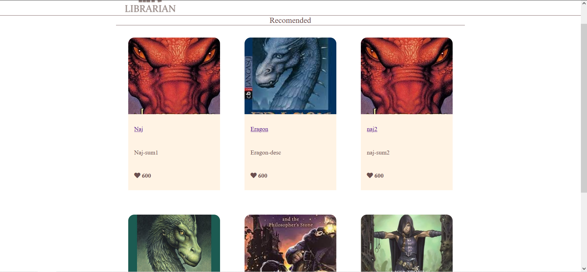
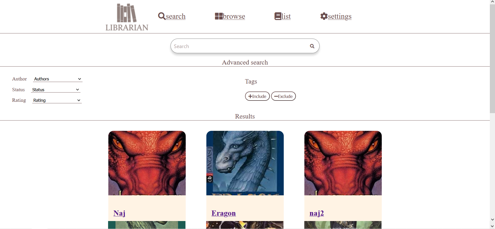
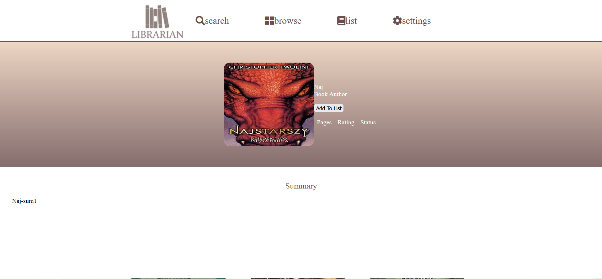

# **LIBRARIAN**

## **Używane technologie:**

- HTML 5
- CSS
- PHP 7.4
- JavaScript
- PostgreeSQL
- Adobe XD (projektowanie)

## **Opis:**
Aplikacja Librarian to twoja wirtualna biblioteka!.Pozwala ona na przeglądanie książek(różnego rodzaju). Oraz w przyszłości będzie ona posiadała możliwość dodawania książek do swojej "biblioteki" - gdzie będzie można oceniać dane książki.

## **Funkcjonalność**

- Wyszukiwanie książek po tytule lub ich opisie
- Wyświetlanie informacji dotyczących książek.
- w przyszłości możliwość dodania ksiązki do swojej listy książek.

## **Role użytkowników:**

### 1) Zwykły użytkownik
- Przeglądanie książek
- w przyszłośći dodawanie książek do swoich list i ocenianie ich.

### 2) Administrator
- Wszystkie możliwości zwykłego użytkownika
- Możliwość dodawania książki z poziomu aplikacji do bazy danych.
- w przyszłości edytowanie informacji dot. ksiażek
- 
## Przykładowe widoki:  ##

## Pełna lista widoków: ##
- strona logowania
- strona rejestracji
- strona dashboard - strona główna
- wyszukiwarka książek
- strona książki
- strona swojej listy książek
- strona ustawień
- strona dodania książki(tylko administrator)

## Uwagi: ##
Niestety nie udało się zaimplementować w czasie wszystkich przewidzianych funkcjonalności. Nie ma dodawania książek do swojej listy oraz wyświetlania swojej listy.
Jednak pozostałe funkcjonalności udało się zaimplementować(co prawda w niepełnej formie - jednak rozbudowanie ich nie stanowi dużego problemu).
W przyszłości będzie można bardzo prosto rozbudować aplikacje o dodatkowe funckje (np algorytm polecania książek na podstawie listy książek użytkownika).
